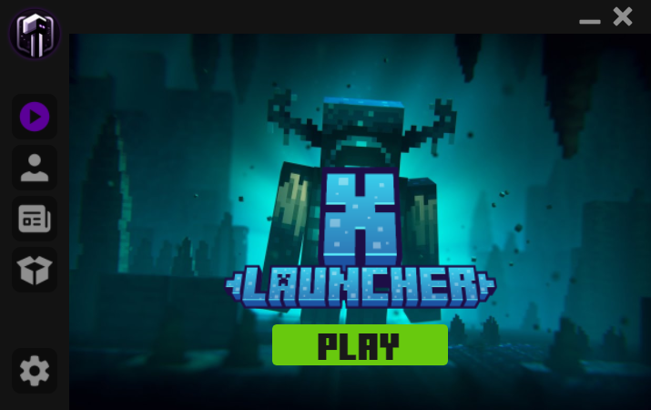

<div align="center">
    
</div>

# Minecraft Launcher



> Launcher de minecraft que hice para un video de YouTube


### 🔩Instalacion

- Clonar repositorio

```console
git clone https://github.com/KeimaSenpai/Script-launcher-Minecraft.git
```

- Crear entorno de desarrollo

```console
pip install virtualenv
virtualenv env
```

- Instalar dependencias

```console
pip install -r requirements.txt
```

🔩Instalación para los usuarios de Cuba

> Para que no gasten megas en la instalacion del paquete pueden usar este comando
> Solo funciona para CUBA este comando

```console
python -m pip install -r requirements.txt --index-url http://nexus.prod.uci.cu/repository/pypi-proxy/simple/ --trusted-host nexus.prod.uci.cu
```

### 📦Para empaquetar

```console
pyinstaller main.py --noconfirm --onedir --console --icon icon_windows.ico --name "XLauncher"
```

> Link de la documentacion [LINK](https://minecraft-launcher-lib.readthedocs.io/en/stable/)

## 📺Video de YouTube

> Recuerda dejar Like y no dejes de suscribirte al canal 👍
> [CREA TU PROPIO LAUNCHER de MINECRAFT](https://youtu.be/5FmjSubDRyw?si=9brYY9OnENftZgft)

## Personas que hicieron este proyecto posible
[](https://github.com/KeimaSenpai/XLauncher-ui/graphs/contributors)
